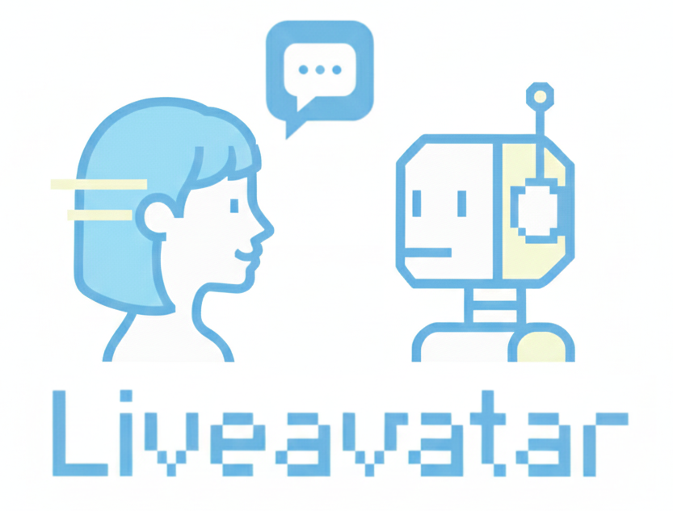

<div align="center">

<p align="center">
  
</p>

<h1>🎬 Live Avatar: Streaming Real-time Audio-Driven Avatar Generation with Infinite Length</h1>

<p>
<a href="#" style="color: inherit;">Yubo Huang</a><sup>1,2</sup> ·
<a href="#" style="color: inherit;">Hailong Guo</a><sup>1,3</sup> ·
<a href="#" style="color: inherit;">Fangtai Wu</a><sup>1,4</sup> ·
<a href="#" style="color: inherit;">Shifeng Zhang</a><sup>1</sup> ·
<a href="#" style="color: inherit;">Shijie Huang</a><sup>1</sup> ·
<a href="#" style="color: inherit;">Qijun Gan</a><sup>4</sup> ·
<a href="#" style="color: inherit;">Lin Liu</a><sup>2</sup> ·
<a href="#" style="color: inherit;">Sirui Zhao</a><sup>2,*</sup> ·
<a href="#" style="color: inherit;">Enhong Chen</a><sup>2,*</sup> ·
<a href="#" style="color: inherit;">Jiaming Liu</a><sup>1,‡</sup> ·
<a href="#" style="color: inherit;">Steven Hoi</a><sup>1</sup>
</p>

<p style="font-size: 0.9em;">
<sup>1</sup> Alibaba Group &nbsp;&nbsp;
<sup>2</sup> University of Science and Technology of China &nbsp;&nbsp;
<sup>3</sup> Beijing University of Posts and Telecommunications &nbsp;&nbsp;
<sup>4</sup> Zhejiang University
</p>

<p style="font-size: 0.9em;">
<sup>*</sup> Corresponding authors. &nbsp;&nbsp; <sup>‡</sup> Project leader.
</p>

<!-- Badges -->
<a href="https://arxiv.org/abs/YOUR_PAPER_ID"></a> <a href="https://huggingface.co/Quark-Vision/Live-Avatar"></a> <a href="https://github.com/Alibaba-Quark/LiveAvatar"></a> <a href="https://liveavatar.github.io/"></a>

</div>

> **TL;DR:** **Live Avatar** is an algorithm–system co-designed framework that enables real-time, streaming, infinite-length interactive avatar video generation. Powered by a **14B-parameter** diffusion model, it achieves **20 FPS** on **5×H800** GPUs with **4-step** sampling and supports **Block-wise Autoregressive** processing for **10,000+** second streaming videos.

<p align="center">
  <iframe
    width="800"
    height="450"
    src="https://www.youtube.com/embed/srbsGlLNpAc?autoplay=1&mute=1&loop=1&playlist=srbsGlLNpAc&controls=1&rel=0"
    title="Live Avatar Demo"
    frameborder="0"
    allow="accelerometer; autoplay; clipboard-write; encrypted-media; gyroscope; picture-in-picture"
    allowfullscreen>
  </iframe>
</p>

---
## ✨ Highlights

<!-- We propose **MultiTalk** , a novel framework for audio-driven multi-person conversational video generation. Given a multi-stream audio input, a reference image and a prompt, MultiTalk generates a video containing interactions following the prompt, with consistent lip motions aligned with the audio. -->

> - ⚡ **​​Real-time Streaming Interaction**​​ - Achieve 20 FPS real-time streaming with low latency
> - ♾️ ​​**​​Infinite-length Autoregressive Generation**​​​​ - Support 10,000+ second continuous video generation
> - 🎨 ​​**​​Generalization Performances**​​​​ - Strong generalization across cartoon characters, singing, and diverse scenarios 


---
## 📰 News
- **[2025.12.02]** The code will be open source in early December.
- **[2025.12.02]** We release Paper and demo page Website.
<!-- - **[2025/09]** Paper accepted to **CVPR/ICCV 2025**. -->

---

## 📑 Todo List

### 🌟 **Early December** (core code release)

- ✅ Release the paper
- ✅ Release the demo website
- ⬜ Release inference code
- ⬜ Release checkpoints on Hugging Face
- ⬜ Release Gradio demo
- ⬜ Experimental real-time streaming inference on H800 GPUs.
  - ⬜ Distribution-matching distillation to 4 steps
  - ⬜ Timestep-forcing pipeline parallelism

### ⚙️ **Later updates**

- ⬜ Optimized real-time streaming inference on RTX 4090 / A100 GPUs.
  - ⬜ Distribution-matching distillation to 3 steps
  - ⬜ Timestep-forcing pipeline parallelism
  - ⬜ SVD quantization
  - ⬜ SageAttention integration
- ⬜ Run with very low VRAM
- ⬜ TTS integration
- ⬜ ComfyUI support
- ⬜ 1.3B model

<!-- ## 🛠️ Installation

Please follow the steps below to set up the environment.

### 1. Create Environment
```bash
conda create -n liveavatar python=3.10 -y
conda activate liveavatar
```

### 2. Install CUDA Dependencies
```bash
conda install nvidia/label/cuda-12.4.1::cuda -y
conda install -c nvidia/label/cuda-12.4.1 cudatoolkit -y
```

### 3. Install PyTorch & Flash Attention
```bash
pip install torch==2.8.0 torchvision==0.23.0 --index-url https://download.pytorch.org/whl/cu128

pip install flash-attn==2.8.3 --no-build-isolation
```

### 4. Install Python Requirements
```bash
pip install -r requirements.txt
```

--- -->

<!-- ## 📥 Download Models

Please download the pretrained checkpoints from [Hugging Face](https://huggingface.co/) and place them in the `checkpoints/` directory.

| Model Component | Description | Link |
| :--- | :--- | :---: |
| `live_avatar` | our model| [Download](#) |
```bash
mkdir -p checkpoints -->
<!-- # Move your downloaded files here -->
<!-- ``` -->

<!-- --- -->

<!-- ## 🚀 Inference

### Streaming Real-time Infinite Inference


```bash
# Recommended: Run with relative path
bash infinite_inference.sh
```

---


--- -->

<!-- ## 📝 Citation

If you find this project useful for your research, please consider citing our paper:

```bibtex
@article{placeholder
}
``` -->

## 🙏 Acknowledgements

We would like to express our gratitude to the following projects:

*   [CausVid](https://github.com/tianweiy/CausVid)
*   [Longlive](https://github.com/NVlabs/LongLive)
*   [WanS2V](https://humanaigc.github.io/wan-s2v-webpage/)